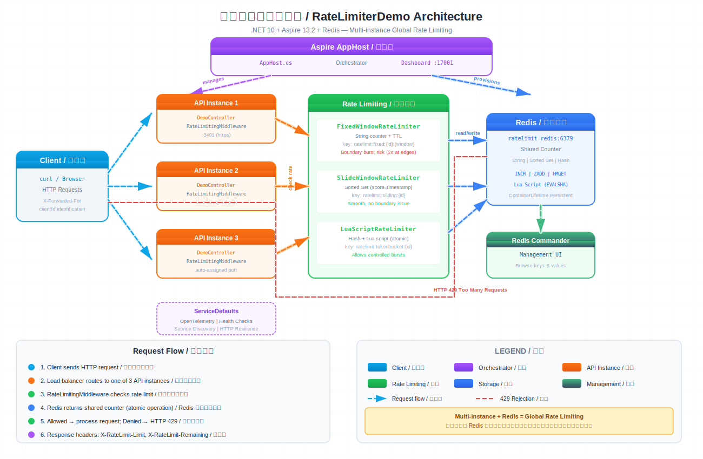

# RateLimiterDemo

基于 .NET Aspire + Redis 的分布式限流系统演示。

## 架构



## 为什么需要多实例 + Redis

进程内限流只在单进程内生效。多实例部署时，每个实例各自维护计数器，实际允许的请求量是 N 倍。Redis 作为共享存储，所有实例共用同一计数器，限流策略全局一致。

| 场景 | 限流失效 | Redis 正常工作 |
|---|---|---|
| 10 个实例，每个接收 10 个请求 | 全部通过（100次） | 第 6 个请求开始返回 429 |
| 负载均衡器随机分发 | 无法预测，经常超限 | 精确控制，100 次后全拦截 |
| 高并发瞬间爆发 | 可能突破限制 2-3 倍 | 原子操作保证精确 |

## 三种限流算法

| | Fixed Window | Sliding Window | Token Bucket |
|---|---|---|---|
| 突发控制 | 差（边界双倍） | 好（平滑） | 好（允许合理突发） |
| 内存开销 | 低（1 个 key） | 高（每请求一条） | 低（1 个 key） |
| 实现复杂度 | 简单 | 中等 | 复杂（Lua 脚本） |
| 原子性 | INCREMENT 天然原子 | Pipeline 批量操作 | Lua 脚本保证 |
| 适用场景 | 简单限流 | 精确限流 | API 配额、流量整形 |

| 算法 | Redis 数据结构 | API 端点 |
|---|---|---|
| Fixed Window | String counter + TTL | `GET /api/demo/fixed-window` |
| Sliding Window | Sorted Set (timestamp+guid) | `GET /api/demo/sliding-window-test` |
| Token Bucket | Hash + Lua script | `GET /api/demo/token-bucket-test` |

## 运行

```bash
dotnet run --project RateLimiterDemo.AppHost
```

启动后访问：
- Aspire Dashboard: `https://localhost:17001`
- Scalar API 文档: API 实例根路径
- Redis Commander: Dashboard 中查看端口

## 技术栈

- .NET 10
- .NET Aspire 13.2
- Redis (StackExchange.Redis)
- OpenTelemetry
